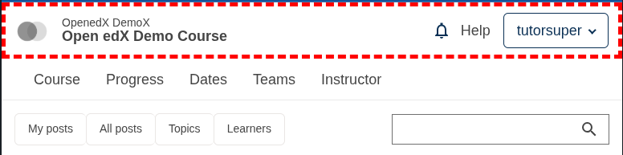
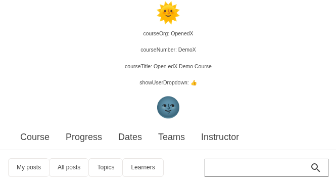

# Header Slot

### Slot ID: `org.openedx.frontend.layout.header_discussions.v1`

This slot is used to replace/modify/hide the discussions header.

## Example (Border)

The following `env.config.jsx` highlights the default header with a dashed red border



```jsx
import { PLUGIN_OPERATIONS } from '@openedx/frontend-plugin-framework';

const config = {
  pluginSlots: {
    'org.openedx.frontend.layout.header_discussions.v1': {
      keepDefault: true,
      plugins: [
        {
          op: PLUGIN_OPERATIONS.Wrap,
          widgetId: 'default_contents',
          wrapper: ({ component }) => <div style={{ border: 'thick dashed red' }}>{component}</div>,
        },
      ]
    },
  },
};

export default config;
```

## Example (Replace)

The following `env.config.jsx` will replace the discussions header entirely



```jsx
import { DIRECT_PLUGIN, PLUGIN_OPERATIONS } from '@openedx/frontend-plugin-framework';

const config = {
  pluginSlots: {
    'org.openedx.frontend.layout.header_discussions.v1': {
      keepDefault: false,
      plugins: [
        {
          op: PLUGIN_OPERATIONS.Insert,
          widget: {
            id: 'custom_header_component',
            type: DIRECT_PLUGIN,
            RenderWidget: ({courseOrg, courseNumber, courseTitle, showUserDropdown}) => (
              <>
                <h1 style={{textAlign: 'center'}}>🌞</h1>
                <p style={{textAlign: 'center'}}>courseOrg: {courseOrg}</p>
                <p style={{textAlign: 'center'}}>courseNumber: {courseNumber}</p>
                <p style={{textAlign: 'center'}}>courseTitle: {courseTitle}</p>
                <p style={{textAlign: 'center'}}>showUserDropdown: {showUserDropdown ? '👍' : '👎'}</p>
                <h1 style={{textAlign: 'center'}}>🌚</h1>
              </>
            ),
          },
        },
      ]
    }
  },
}

export default config;
```
